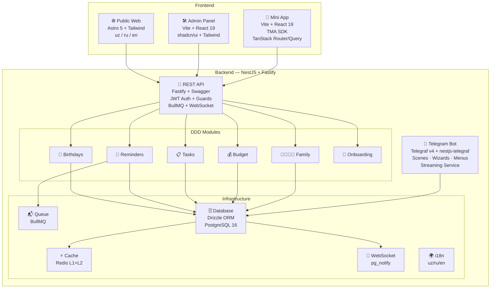
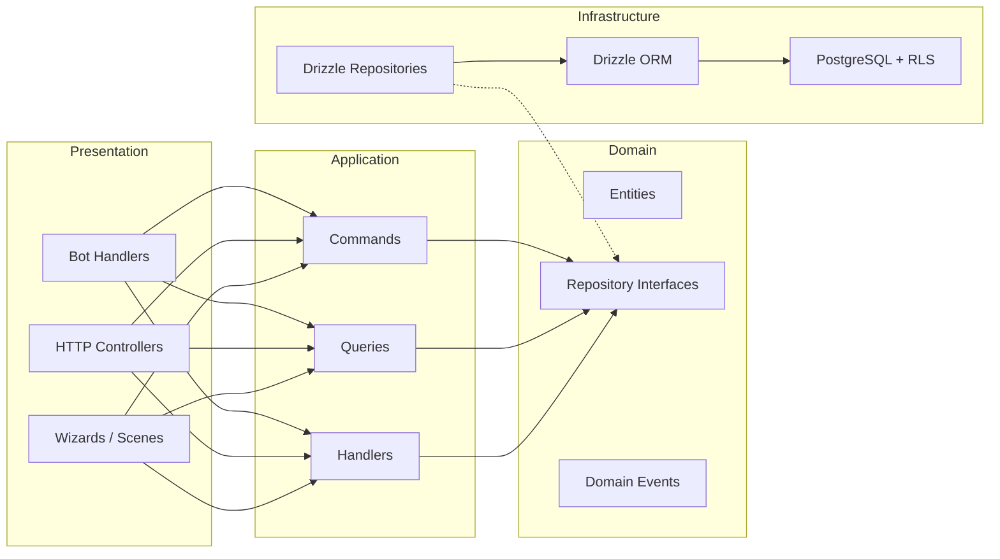
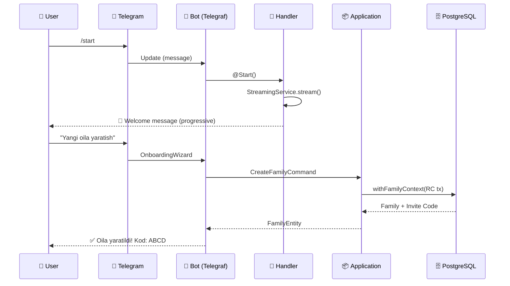
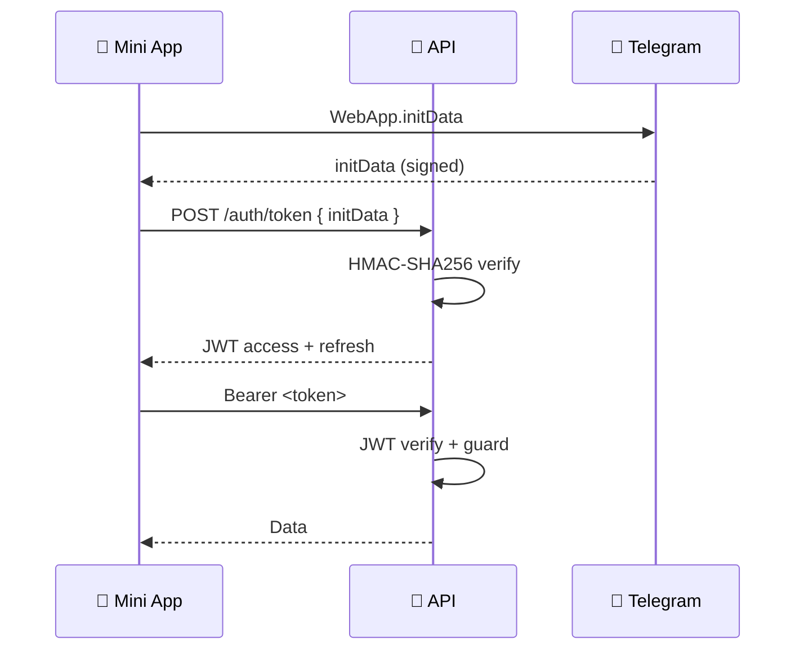
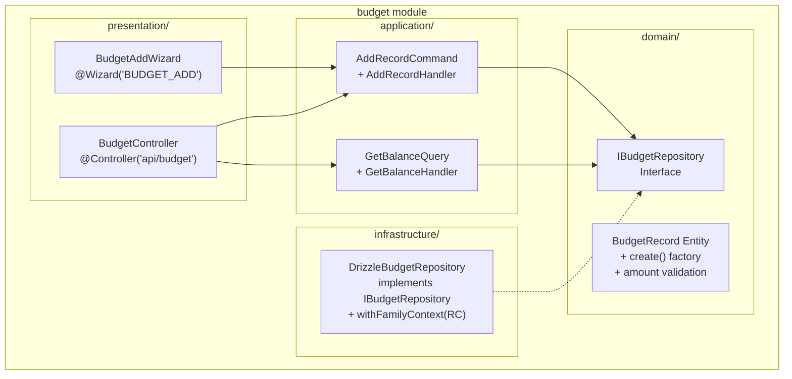
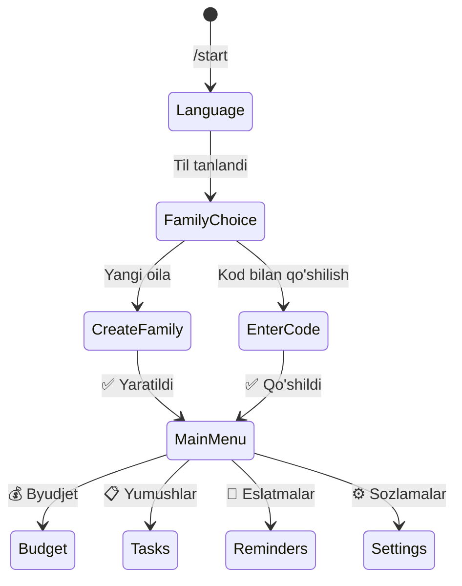

# 🏠 @uyimiz_bot

<p align="center">
  
  
  
  
  
  
  
  
</p>

<p align="center"><strong>Oilaviy boshqaruv platformasi — Telegram bot, Mini App, Admin Panel, Public Landing</strong></p>

<p align="center">🇺🇿 O'zbekcha &nbsp;|&nbsp; 🇷🇺 Русский &nbsp;|&nbsp; 🇬🇧 English</p>

---

## 📐 Arxitektura



### DDD 4-Layer Architecture



### Request Flow



---

## 🚀 Quick Start

```bash
# 1. Clone
git clone https://github.com/xam1dullo/uyimiz_bot.git
cd uyimiz_bot

# 2. Install dependencies
pnpm install

# 3. Setup environment
cp packages/config/.env.example packages/config/.env.development
# Edit: BOT_TOKEN (from @BotFather), DATABASE_URL, REDIS_URL, JWT_SECRET

# 4. Start infrastructure
docker compose up -d postgres redis

# 5. Push database schema
pnpm --filter @uyimiz/db db:push

# 6. Apply custom migrations (RLS, triggers, indexes)
docker exec -i $(docker ps -qf name=postgres) psql -U postgres -d uyimiz_dev \
  < packages/db/src/migrations/0001_rls.sql
docker exec -i $(docker ps -qf name=postgres) psql -U postgres -d uyimiz_dev \
  < packages/db/src/migrations/0002_triggers.sql
docker exec -i $(docker ps -qf name=postgres) psql -U postgres -d uyimiz_dev \
  < packages/db/src/migrations/0003_rls_hardening.sql
docker exec -i $(docker ps -qf name=postgres) psql -U postgres -d uyimiz_dev \
  < packages/db/src/migrations/0004_performance_indexes.sql

# 7. Run all apps
pnpm turbo dev
```

### URL'lar

| App | Local | Production |
|-----|-------|------------|
| **API** | `http://localhost:3001` | `https://api.uyimiz.uz` |
| **Swagger Docs** | `http://localhost:3001/api/docs` | `https://api.uyimiz.uz/api/docs` |
| **Mini App** | `http://localhost:5173` | `https://t.me/uyimiz_bot/app` |
| **Admin Panel** | `http://localhost:5174` | `https://admin.uyimiz.uz` |
| **Public Web** | `http://localhost:4321` | `https://uyimiz.uz` |
| **Telegram Bot** | [@uyimiz_bot](https://t.me/uyimiz_bot) | [@uyimiz_bot](https://t.me/uyimiz_bot) |

---

## 🧱 Tech Stack

<table>
<tr>
<td width="50%">

### Backend
| Layer | Technology |
|-------|-----------|
| Framework | NestJS 11 + Fastify adapter |
| Bot | Telegraf v4 + nestjs-telegraf |
| ORM | Drizzle ORM |
| Database | PostgreSQL 16 |
| Cache | Redis + cache-manager (L1+L2) |
| Queue | BullMQ |
| Auth | JWT + Telegram initData HMAC |
| Validation | Zod v3 + class-validator |
| Docs | Swagger (OpenAPI) |
| WebSocket | Socket.io + pg_notify |
| API | REST (Fastify) |

</td>
<td width="50%">

### Frontend
| Layer | Technology |
|-------|-----------|
| Mini App | Vite + React 19 + TMA SDK |
| Admin | Vite + React 19 + shadcn/ui |
| Web | Astro 5 + Tailwind CSS |
| Routing | TanStack Router |
| Data | TanStack Query v5 |
| State | Zustand v4 |
| Charts | Recharts |
| Styling | Tailwind CSS |

### DevOps
| Layer | Technology |
|-------|-----------|
| Monorepo | Turborepo + pnpm |
| Container | Docker + docker-compose |
| Proxy | Caddy v2 |
| CI | GitHub Actions |

</td>
</tr>
</table>

---

## 📂 Project Structure

```
uyimiz_bot/
├── apps/
│   ├── api/                          # NestJS backend + Telegram bot
│   │   └── src/
│   │       ├── bot/                  #   Bot handlers, menus, wizards, core
│   │       ├── modules/              #   DDD bounded contexts
│   │       │   ├── auth/             #   JWT + Telegram initData auth
│   │       │   ├── family/           #   Oila boshqaruvi
│   │       │   ├── budget/           #   Byudjet (daromad/xarajat)
│   │       │   ├── tasks/            #   Yumushlar + gamification
│   │       │   ├── reminders/        #   Eslatmalar + scheduler
│   │       │   ├── birthdays/        #   Tug'ilgan kunlar
│   │       │   └── onboarding/       #   Ro'yxatdan o'tish wizard
│   │       └── infrastructure/       #   Cache, Queue, i18n, WebSocket, DB
│   ├── miniapp/                      # Telegram Mini App
│   ├── web/                          # Public landing (uz/ru/en)
│   └── admin/                        # Admin panel
├── packages/
│   ├── db/                           # Drizzle schema + migrations + RLS
│   ├── shared/                       # Shared types + constants + i18n keys
│   └── config/                       # Zod environment validation
├── scripts/                          # start-dev.sh, quality-gate.sh
├── docker-compose.yml                # Dev infra
├── docker-compose.prod.yml           # Production
└── turbo.json                        # Turborepo pipeline
```

---

## 🔐 Security

### Auth Flow



### RLS (Row-Level Security)

```sql
-- All family-scoped tables have RLS enforced
ALTER TABLE budget_records FORCE ROW LEVEL SECURITY;
ALTER TABLE tasks FORCE ROW LEVEL SECURITY;
ALTER TABLE reminders FORCE ROW LEVEL SECURITY;

-- Each family can only see their own data
CREATE POLICY family_isolation ON budget_records
  USING (family_id = current_setting('app.current_family_id')::uuid);
```

**4 migrations:** schema → RLS → triggers → performance indexes

---

## 🏗️ Module Detail: Budget (DDD Example)



---

## 📊 Features & Status

| Feature | Bot | Mini App | Admin | API |
|---------|:---:|:--------:|:-----:|:---:|
| **Ro'yxatdan o'tish** | ✅ Wizard | — | — | ✅ |
| **Oila yaratish** | ✅ | ✅ | ✅ | ✅ |
| **Byudjet** | ✅ Wizard | ✅ | — | ✅ |
| **Yumushlar** | ✅ | ✅ | — | ✅ |
| **Eslatmalar** | ✅ | ✅ | — | ✅ |
| **Tug'ilgan kunlar** | ✅ | ✅ | — | ✅ |
| **Sozlamalar** | ✅ Menu | ✅ | — | — |
| **Admin Dashboard** | — | — | ✅ KPI | — |
| **Audit Logs** | — | — | ✅ | — |
| **Leaderboard** | 🚧 | 🚧 | — | — |
| **Health / Diet** | 📅 V1 | 📅 V1 | — | 📅 |

---

## 🧪 Quality

```bash
pnpm typecheck          # All packages: ✅
pnpm test               # 98 tests: ✅
bash scripts/quality-gate.sh  # typecheck + lint + build + db-schema
```

### Quality Gate

| Check | Status |
|-------|--------|
| TypeScript (`strict: true`) | ✅ |
| TypeCheck (5 packages) | ✅ |
| Build (4 apps) | ✅ |
| Tests (98 passing) | ✅ |
| ESLint | 🚧 v9 config |

---

## 🤖 Bot Commands

| Command | Description |
|---------|-------------|
| `/start` | Ro'yxatdan o'tish va onboarding wizard |
| `/menu` | Asosiy menyu |
| `/cancel` | Har qanday amalni bekor qilish |
| `/balance` | Balansni ko'rish |

### Onboarding Flow



---

## 📦 Scripts

```bash
pnpm turbo dev          # Barcha app'lar
pnpm turbo build        # Production build
pnpm test               # Barcha testlar
pnpm typecheck          # TypeScript tekshiruvi
bash scripts/start-dev.sh   # API ni ishga tushirish
```

---

## 📄 License

MIT © 2024-2026
